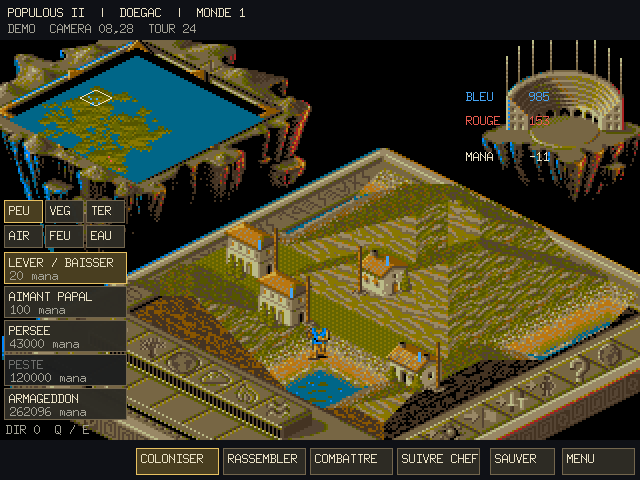
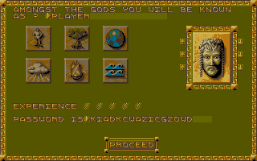
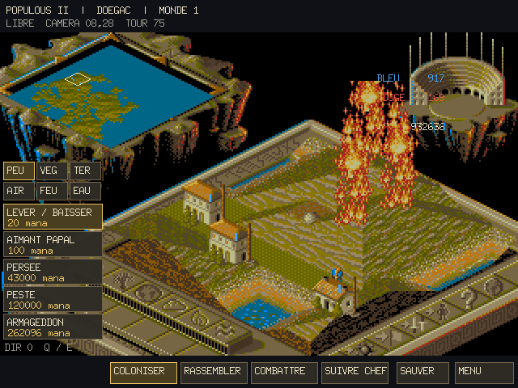

# Go Populous II

A Go/Ebitengine recreation of **Populous II: Trials of the Olympian Gods**.
The game uses the original Amiga graphics, fonts, music, samples and campaign
as locally prepared assets. Its simulation, menus, rendering and audio replay
are ordinary Go code; the playing application does not load the Amiga executable.

The independent engine includes all 29 powers, six heroes, terrain sculpting,
followers and towns, computer opposition, the 1,000-world campaign, deity
profiles/passwords, results and the animated ending. It also provides custom
rules, a detached map editor, animated power help, JSON saves, original GAM
interchange and two-player TCP sessions.

The original resources are not distributed in this repository. Import them
from your own two main-game ADFs, then export the portable asset package.

```sh
sh tools/exclude-local-assets.sh
go run ./cmd/import-assets -adf "/path/to/disk A.adf" -adf "/path/to/disk B.adf"
go run ./cmd/export-visual-assets -output assets/runtime/data
go run ./cmd/export-audio-assets -output assets/runtime/data/audio
go run ./cmd/populous2
```

To identify the disks, the [Planet Emu Amiga ADF catalogue](https://www.planetemu.net/roms/commodore-amiga-games-adf?page=P)
lists **Populous II - Trials of the Olympian Gods**, **Disk 1 of 2** and
**Disk 2 of 2**. The [asset setup guide](docs/ASSET_SETUP.md) documents supported
revisions and validation. The separate Challenge extension is not the main game.

## Run and build

Go 1.25 or newer and the normal Ebitengine platform prerequisites are required.
The default build embeds only the exported asset package and can run outside
the repository. A clean source checkout builds with a placeholder and needs
asset preparation before playing.

```sh
go build -o bin/populous2 ./cmd/populous2
go run ./cmd/populous2 -data /path/to/exported/assets
go run ./cmd/populous2 -save /path/to/saves/game.json
go run ./cmd/populous2 -listen 127.0.0.1:2468
go run ./cmd/populous2 -connect 127.0.0.1:2468
```

Display/input run at 50 PAL updates per second, with 12.5 simulation passes
per second. Audio retains its own clock. Mouse controls on the left panel
expose powers, tactical modes, the rally marker, help, options and saving.

| Action | Input |
|---|---|
| Raise land / release a town or lower land | Left / right click |
| Choose an element and power | Tab, then the visible buttons |
| Settle / rally / join / fight | 1 / 2 / 3 / 4 |
| Move the view | Arrow keys or world overview |
| Directional powers | Q / E |
| Lightning marker / activate / dismiss | Left click / Enter / right click |
| Options / map editor / help | O / P / H |
| Browse and load / browse and save | F9 / F10 |
| Pause / return to the menu | Space / Escape |

The save browser confirms replacement of an existing file. Invalid loads leave
the current game intact. JSON preserves the complete Go session; GAM translates
original file fields at a separate codec boundary. States the original format
cannot represent produce a clear export error. A failed TCP round pauses the
session; automatic reconnection is not implemented.

## Validation and reference applications

The independent launcher's dependency test rejects the earlier executable-based
translation. A standalone build has been run outside the repository with only
portable images, semantic music/sample data and campaign/landscape files.
Tests cover all power lifetimes and saved continuations, representative campaign
worlds, profiles, results, original ending pixels/PAL timing, multiplayer and
GAM continuation. An optional local reference comparison matches 160 no-input
physics passes in world 12 for terrain, followers, mana and RNG. This is bounded
fidelity evidence, not a claim that every combination in all worlds is identical.

```sh
go test ./internal/engine ./internal/music ./internal/visualassets ./internal/gamcodec
POPULOUS2_REFERENCE_COMPARE=1 go test ./internal/populous2 -run '^TestIndependentEngineCampaignReferenceOptional$' -count=1
```

The original executable is consulted only by import/reference tools. The earlier
translation remains available as `cmd/populous2-native`, and the inherited
higher-resolution diagnostic version as `cmd/populous2-legacy`. Their runtime
requirements and older captures are documented in [FEATURES.md](docs/FEATURES.md).
The [engine guide](docs/GO_ENGINE.md) and [implementation audit](docs/GO_ENGINE_AUDIT.md)
describe architecture, interoperability and precise verification limits.






