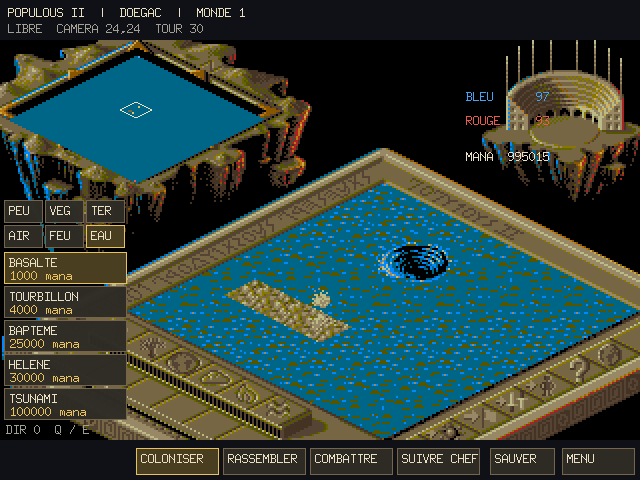
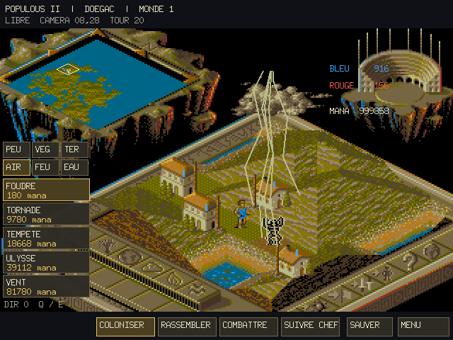
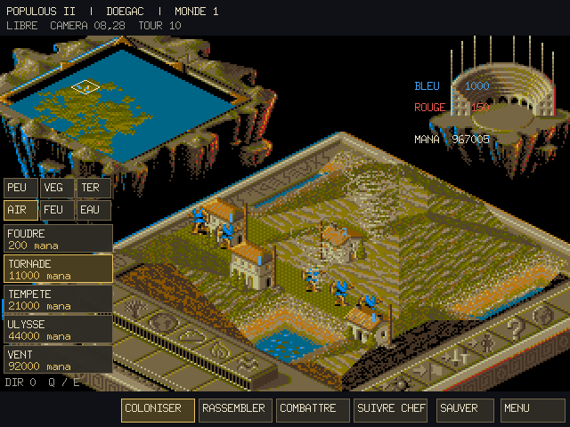
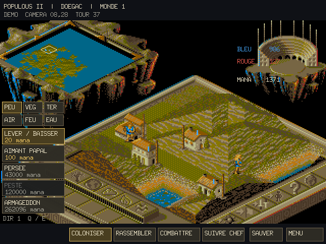

# Go Populous II

An ongoing Go/Ebitengine recreation of **Populous II: Trials of the Olympian
Gods**, using its original Amiga graphics, campaign and audio resources.

The startup screen uses the original bitmap, palette, font and five visible
mouse actions. The playable version includes an isometric world, followers, settlements,
power selection, computer opposition, a demonstration mode, native Amiga .GAM interoperability and Go saves.
Native translations now replace several parts of the supplied Populous I
foundation: terrain generation, random streams, starting populations, town
work, mana costs, ordinary fractional walking, complete leader-to-hero
conversion and persistent ground effects. Hero creation retains native leg
and target fields, relocates the magnet, clears town farms and uses original
speed, population and sound rules.
Wind now pushes linked occupants using the original parcel scan order;
tidal waves start from adjacent water, branch sideways and lower shallow shores.
Their native controllers and directions survive Go saves.
Plague uses the original per-record clock and actual merge/birth inheritance.
Armageddon converts eligible groups into heroes and enables their terrain
raising; it retains the original state filters, plague cleanup and recast rules.
Forest and Renew Land use complete native allocation/terrain routines, while
the raw scenery pass preserves signed aging, burial and fire/town interactions.
Campaign results use original identity-based elimination, score arithmetic,
bolt rewards and world skipping. Pending and applied results survive saves;
the result screen applies its reward once and offers the native deity allocation
step after a campaign victory. Winning the final world plays the supplied Zeus
animation and original scrolltext at its native PAL cadence. Original result
requester is displayed after 101 PAL VBlanks. The deity screen and game options
use their original layouts, masked artwork, experience strips and controls;
The native integration target connects the original file and Conquest
requesters, in-game/options/serial routing and power-help preview children.
Their complete interactive combinations and longer gameplay remain under
validation.
Whirlwinds now lift, transport and release native followers, collapse town farms
and create original water children. Their complete retained controllers replace
the former motion-only World handler.
Fire columns use complete raw routing and linked victim/town scans. Trees and
rocks use original age-dependent emergence/burial rectangles when drawn.
The ten-record native scenario script now creates its original disasters,
plantings and neutral inventions, one due event per simulation update.

**The complete original feature set is still being converted.** Translated
native controllers now cover all29 power handlers and the follower/combat/
result state families. Full campaign pacing, broader combined interactions
and complete multiplayer/interactive fidelity remain under validation. [The feature inventory](docs/FEATURES.md)
distinguishes native translations from provisional behavior.










## Run

Go 1.25 or newer and the normal Ebitengine platform prerequisites are required.
All runtime resources are embedded; local reference disks are not needed to
build or run the game.

```sh
go run ./cmd/populous2
go run ./cmd/populous2 -save-root /path/to/existing/save-directory
go run ./cmd/populous2 -listen 127.0.0.1:2468
go run ./cmd/populous2 -connect 127.0.0.1:2468
go run ./cmd/populous2 -export-root /path/to/existing/export-directory
go build -o bin/populous2 ./cmd/populous2
```

The main command runs the original320×200 register-bearing runtime at50
updates/s: actual startup/menu/world construction, native render/input/
simulation, raw GAM dialogs, four-channel audio and retained result/award/
deity/ending/reset controllers. `cmd/populous2-native` is an alias of the same
launcher. Native gameplay is compared with original CPU execution; the
remaining fidelity audit is documented in docs/FEATURES.md.

The file requester uses the current working directory unless `-save-root`
selects another existing directory. It writes only in response to the
original Save action. Existing original requester overwrite/error behavior
remains available. Diagnostic `-auto-start` clicks the real custom-game button,
and `-frames`, `-capture-update` and `-screenshot` provide bounded framebuffer
captures without substituting a generated World.

The inherited higher-resolution diagnostic engine is retained separately:

```sh
go run ./cmd/populous2-legacy -play
go run ./cmd/populous2-legacy -custom
go run ./cmd/populous2-legacy -demo -world 0
go run ./cmd/populous2-legacy -play -code DOEGAC
go run ./cmd/populous2-legacy -deity
go run ./cmd/populous2-legacy -fire-columns
go run ./cmd/populous2-legacy -whirlwinds
go run ./cmd/populous2-legacy -fungus
go run ./cmd/populous2-legacy -custom -rules
```

`-listen` and `-connect` configure the host byte stream for the original serial
requester. They preserve its profile, connect, handshake and command behavior.
Full paired interactive gameplay is still under validation.

`-save-root` binds the original file requester's native paths to an existing
directory. Saving/loading uses raw GAM bytes and the original overwrite/error
dialogs; the working directory is used when no directory is selected.

`-export-root` enables the original editor screen-export command and writes
numbered `.SCR` files with the native ILBM palette and planar rows. The
directory must already exist; existing files are preserved.

The native deity editor preserves original portrait parts, experience/bolt
controls and password format, including raw name/password text editing.

The inherited command uses a 960 × 720 window with a 640 × 480 logical
display and doubled Amiga artwork. The native integration command instead
uses the original320 × 200 display at50 updates/s. Input updates at 60 Hz; the simulation uses the nominal PAL
VBlank cadence of 50 updates per second. `-simulation-rate` selects a diagnostic
rate. Original CPU-bound throughput and special idle pacing remain comparison
targets; the viewport-size value eight is not a simulation-rate setting.

`-custom` currently exposes all 29 Amiga powers for testing. It does not yet
apply the original conquest-based custom-game unlocking policy.

`-fire-columns`, `-whirlwinds` and `-fungus` place effects near the camera for
inspecting original composite art and controllers. The whirlwind and fungus
presentations also disable follower attrition and fatal water as
diagnostic overrides.
For a bounded application-buffer capture:

```sh
go run ./cmd/populous2-legacy -whirlwinds -frames 180 -capture-update 12 -screenshot /tmp/populous2-whirlwinds.png
```

The screenshot path must not exist. Native pickup/release, town collapse and
child whirlpools have translated source controllers with independent CPU
comparisons. These diagnostic inherited-command presentations are separate
from full campaign fidelity; their pacing is not evidence of original gameplay.
The native integration target is validated against complete source main-frame
sequences, with remaining coverage tracked in docs/FEATURES.md.

## Controls

| Action | Input |
|---|---|
| Raise/lower terrain | Left/right click |
| Release a group from a dwelling | Right click on the dwelling |
| Move the camera | WASD, arrows, or the world map |
| Select a power | Element, power, then target |
| Paint/remove roads | Hold left/right mouse button and move |
| Extend city walls | Place each cell beside an existing wall |
| Effect direction | Q / E |
| Place/activate/dismiss Lightning | Left click / Enter / right click while Lightning is selected |
| Papal magnet / find the leader | M / C |
| Settle, gather, fight, follow | 1 / 2 / 3 / 4 |
| Pause / help | Space / H |
| Mute audio | N |
| Save / load | F5 / F9 |
| Menu / fullscreen | Escape / F |
| Continue after a result | Enter |
| Create/edit the deity from the menu | G or the deity button |
| View/edit scenario rules | O (editable separately for each side in custom games) |

Prices shown are the actual mana balance costs, including the original
per-element experience reductions. The native score and sample bank play
through the Go audio reader. Hardware timing and all sound-event bindings
still need verification.

F5/F9 and the startup Load action open the original `.GAM` file requester,
with directory/name fields, twelve visible rows, overwrite confirmation and
the original transfer-error dialog. The initial filename is `go-populous2.GAM`;
`-save-file` or `POPULOUS2_SAVE_PATH` selects another initial path. Host lookup
is case-insensitive like Amiga DOS and retains the existing filename on overwrite.
Native import/export preserves the original uncompressed transfer block, actor
graph, templates, profile, landscape, camera and random state. The explicit
`ReadGameFile`/`WriteGameFile` APIs also retain Go JSON `.sav` files, including
conversion-specific pending campaign results; the native browser lists `.GAM` files.

```sh
go run ./cmd/populous2-legacy -load-game /path/to/PARTIE.GAM
go run ./cmd/populous2-legacy -play -save-file go-populous2.sav
```

The Go JSON format preserves retained native actor, deity and marker bytes, town structure overlays,
lightning markers, bolt chains, managed victim states,
the mixed actor graph and movement-pressure bytes, native
Basalt/Whirlpool controllers and ordinary walkers' fractional positions, animation clocks
and timers, along with follower hazard states and sound events, fungus bounds
and pending references, both scenario option words, native effects and death
animations, the deity profile, scenery, the 32-bit random state, follower
references, town work, infection and persistent ground effects.

Earlier Go saves remain readable. Versions 1–2 receive the corrected
Helen/tsunami ID mapping; version 12 also corrects earlier basalt/whirlpool IDs
30/31. Generic whirlwinds migrate into native effect records. Earlier fungus
damage marks migrate to native seeds and collecting controllers. Native file
imports also retain fields that are not exposed by the current interface.

Earlier generic whirlpools migrate to native controller records. Earlier
basalt marks retain their existing terrain and become persistent native-family
tiles. Old saves did not record mixed actor order/pressure; their graph is
initialized from the retained actor pools during migration.
Version 16 adds the original marker records to their mixed map chains and
retains unidentified deity fields. Earlier saves initialize those records from
their existing player state. Version 17 also retains native direct-raising and
allocation-inhibition latches. The World loop uses native contact, combat and
retained aftermath controllers, complete terrain prepass, water/conversion/
burning states, magnet/captive routes and native crossing admission. Combined
hero/environment interactions and the complete campaign still remain under
integration. Version 18 includes native town production/emigration,
rare-birth neutral records, their separate owner and effect creator state,
and the original rare-creation deadline. Version 19 retains environmental
controller ownership independently of stale kind bytes, including directed
earthquakes, volcano growth/eruption and lava. Neutral composition and owner-3
water children now have complete original-machine comparisons. Remaining powers,
campaign behavior, menus and multiplayer are tracked in the feature inventory.
Version 20 adds native Storm clouds/thunder, FireRain meteors and the retained
command context affected by their original writes. Delayed meteors remain
unlinked and hidden until activation; falling height comes from the decoded
sprite layers. Older generic weather saves migrate into native records.
Version 21 adds wind/wave controllers with original directions, pool order
and saved continuation. Older provisional effects migrate without a new cast.
Version 22 retains native plague phases and Armageddon's terrain permission.
Legacy global-war saves lose their inherited war lock without replaying a cast;
old disease flags receive a valid native overlay phase.
Version 23 retains the native unpaused frame counter, game/profile selection,
weighted command use and pending/applied campaign outcome. Earlier saves retain
their elapsed simulation count and receive original deity identity values.
Version 24 retains the raw script cursor/table and scratch/control aliases.
Older saves start the script at its first event because no previous cursor was
recorded; loaded scripts otherwise continue without replaying consumed events.

Lightning uses the original marker/activation interaction. Placing or moving
the marker does not debit mana; activation uses the native power price and can
create a partial volley when the effect pool fills. A victim remains allocated
through its stun/recovery/death sequence, including signed population results.
Town support and farm repaint now use the native compositor, including all
49 cells at the largest stage. Founding/contact dispatch and remaining
water/hero handlers still need their complete World integrations.

The deity screen uses the original three-part face artwork, eight variants per
part, five starting bolts and one experience unit per allocated bolt. Click the
profile code to enter an original sixteen-letter password. The separate name
field is not included in that code. Campaign scoring and experience awards
still require their full native statistic integration.

## Native data and verification

The decoder is currently specific to the supplied French executable revision.
`POPULOUS2_DATA_DIR` can select another extracted installation containing the
same executable and resource catalog. Unsupported layouts fail during loading.

```sh
go run ./cmd/assetcheck
go run ./cmd/assetcheck -images /tmp/populous2-images
go test ./...
go vet ./...
go test -race ./internal/amiga ./internal/populous2 ./internal/legacy
go run ./cmd/simcheck -world 0 -ticks 4800
```

`simcheck` and the data/simulation tests work without a display. Terrain tests
compare all 4,225 heights against eight executions of the original 68000
routine. Nine ground-effect references compare complete tile maps and final
random states. Other checks cover original resource integrity, graphics,
wide follower IDs, mana, hero attributes, save continuation, audio and slopes.
Ordinary follower tests compare 72 native movement traces and retain the
original per-owner animation banks, including high-speed facing quirks.
Target selection, waiting, swimming, hero movement and combat still use
inherited adapters. These checks establish the tested routines; they do not establish complete
original-game parity.

[Native rules](docs/NATIVE_RULES.md), [conversion notes](docs/PORTAGE.md),
[validation](docs/VALIDATION.md) and [provenance](docs/PROVENANCE.md) document
the implementation and its remaining limits.

## Layout

| Directory | Purpose |
|---|---|
| `internal/amiga` | Strict ADF/OFS/FFS and Hunk readers |
| `internal/populous2` | Native resource, campaign, rule and sound translations |
| `internal/legacy` | Adapted foundation from the supplied Populous I recreation |
| `internal/fixedstep` | Simulation scheduler |
| `internal/game` | Ebitengine interface, rendering and audio integration |
| `assets/amiga` | Original runtime resources and executable tables |
| `cmd` | Game, asset inspection and simulation commands |
| `tools` | Optional bounded disassembly helper |
| `docs` | Feature inventory, native offsets and validation evidence |

The reused Go code retains GPL-3.0 licensing. Original game resources have
separate provenance and rights; see [PROVENANCE.md](docs/PROVENANCE.md).

## Conquest world selection

Choose Conquest from the original startup menu, then select a world by its
code before proceeding. The requester displays the live scenario rules and
available powers; click the opponent name for the original biography and face,
or a power icon for its original help text. World codes load the original
250-byte campaign record without clearing the retained session. The power-help
preview animations and source-exact text-input timing are still being integrated.
